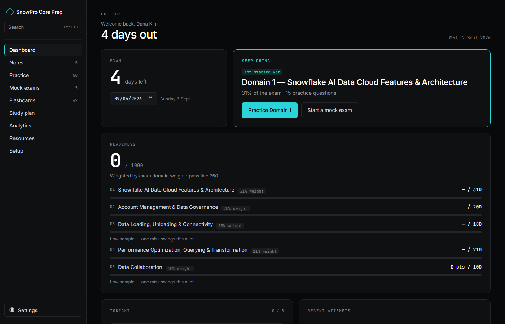
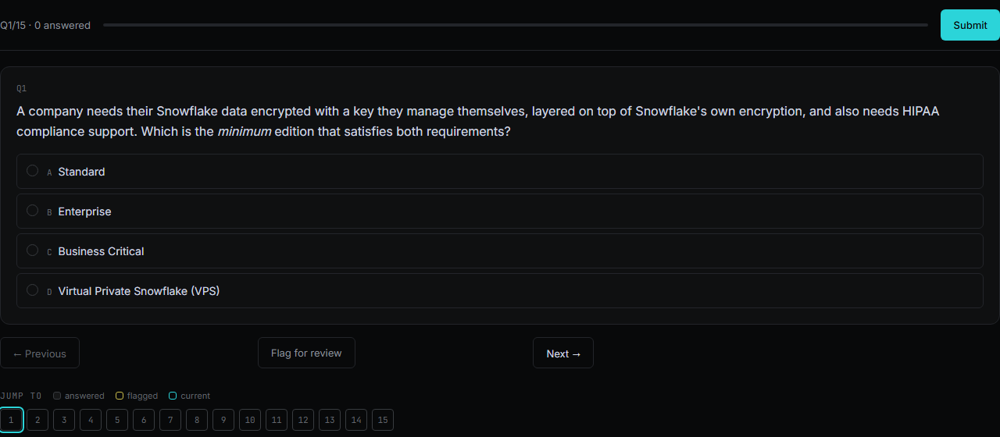
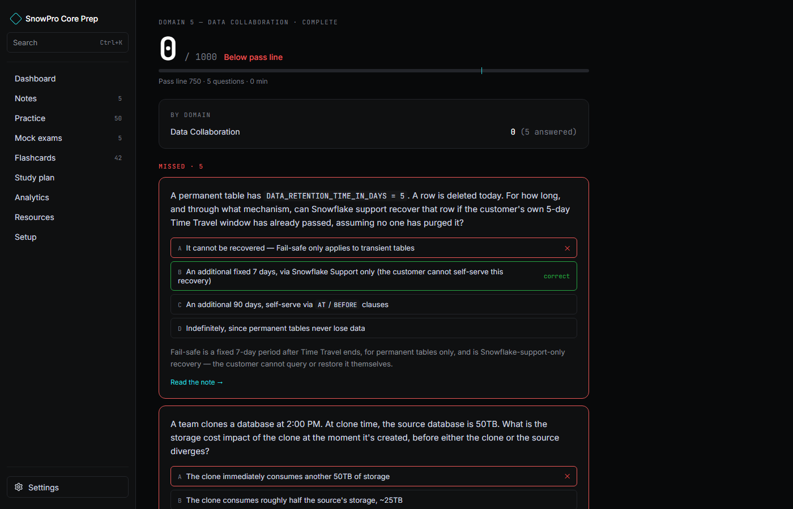
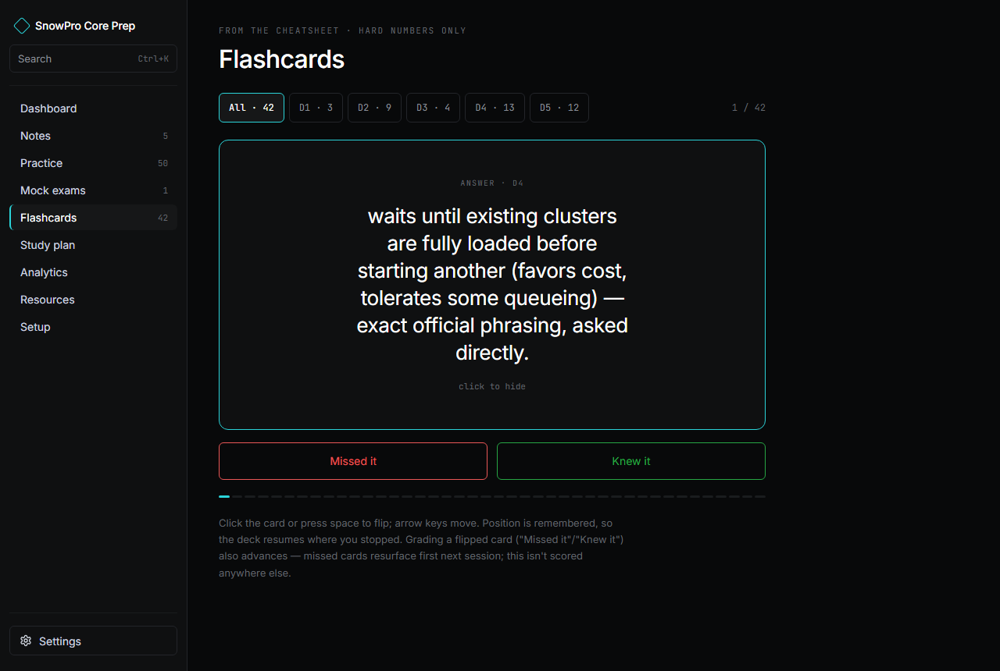
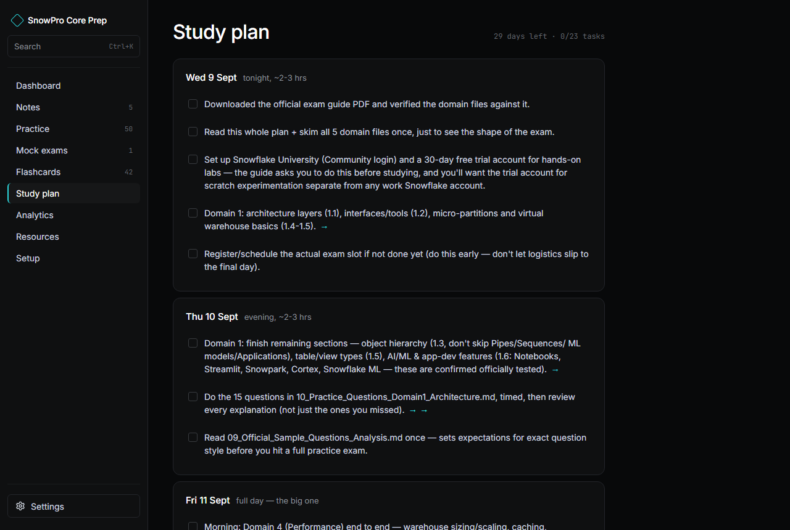
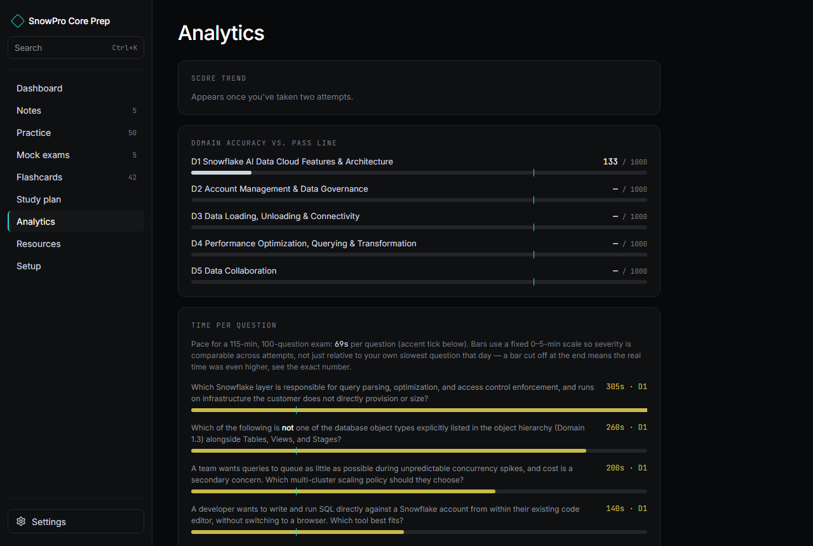

# SnowPro Core Prep

[](https://github.com/noobGB/snowpro-core-prep/actions/workflows/ci.yml)

A local, offline-first study app for the Snowflake **SnowPro Core (COF-C03)** certification —
turns a folder of markdown notes into a full study tool: domain notes, practice questions, timed
mock exams, flashcards, a day-by-day plan, and analytics. No account, no cloud service, no
telemetry — your content and your progress both stay on your machine.

> **🤖 If you're an AI coding agent working in this repo, read [`CLAUDE.md`](CLAUDE.md) first** —
> architecture, file layout, data flow, and known gotchas, written specifically for that. The rest
> of this README (below) is written for humans: what the app does, how to run it, how to use it.


*Exam countdown, weighted readiness, and today's plan tasks — all in one view.*

## Why this exists

Most exam-prep tools are either a paywalled question bank or a pile of markdown files with no way
to actually drill yourself. This is the middle path: write your study notes and practice questions
as plain markdown, and a content pipeline turns them into a real app — scored quizzes, a
spaced-ish flashcard deck, readiness analytics weighted by actual exam domain weights, and a study
plan that shifts to fit whatever exam date you set.

It ships with a real, original set of SnowPro Core notes and a bank of 500 distinct practice/mock
questions — 50 domain-authored practice questions plus five full-length, 100-question mock exams
with zero repeated questions across the five
([`SnowPro_Notes_and_Questions/`](SnowPro_Notes_and_Questions/)) — clone it and it works out of
the box. It's built around that exam's structure (5 weighted domains, 100 questions, 115 minutes,
pass line 750/1000), but the content pipeline itself doesn't know anything Snowflake-specific —
replace the markdown with your own following the same shape and it works for a different exam
entirely. See [Adding or editing content](#adding-or-editing-content) below.

## Features

- **Domain notes** — a proper reading view (table of contents, scrollspy, "quiz me on this
  section") generated from your markdown, not just links out to it.
- **Practice** — one card per domain (question count, weight, last score). Runs the whole set
  untimed, no configuration step. Every wrong answer automatically joins a **missed-question
  notebook** (Practice page → filter toggle) — click **Retry these** to start a fresh session
  containing just those questions.
- **Mock exams** — full-length, timed, matching the real exam's question count and domain split.
  A pre-start screen states the rules (no pause, auto-submits at zero) before the clock starts.
  Closing the tab doesn't stop the clock, but does leave it resumable — only one in-progress mock
  at a time.
- **One question per screen** (shared by Practice and Mock) — Prev/Next, arrow-key navigation,
  flag-for-review, and a jump palette showing answered/flagged/current at a glance, closer to how
  the real exam interface paces you than a long scrolling quiz page.
- **Results & review** — after any attempt: wrong answers first, then partial credit, then
  unanswered, with everything-correct collapsed by default so review time goes to your mistakes.
  Each question shows every option marked right/picked/wrong, its explanation, and a **"Read the
  note →"** link straight back to the relevant domain section.
- **Flashcards** — flip-card drilling with a minimal knew-it/missed-it rating that biases which
  cards resurface first next session.
- **Study plan** — a day-by-day checklist that remaps itself against your actual exam date, not a
  fixed calendar.
- **Analytics** — a weighted readiness score, per-domain breakdown, and pacing feedback benchmarked
  against the real exam's time budget.
- **Resources** — official links plus per-domain study resources, with a standing caution against
  "exam dump" sites.
- **Setup** — a checkable, step-by-step walkthrough for hands-on practice against a real Snowflake
  account (CLI install, key-pair auth, a least-privilege sandbox role) — commands are copyable,
  each step is its own checkbox.
- **MCP server** (`mcp-server/`) — quiz yourself conversationally from Claude Desktop, Claude Code,
  or any other MCP-compatible host instead of clicking through the web UI. Reads/writes the exact
  same progress file the container serves, so a session run through the MCP server shows up in the
  web app's Analytics and vice versa. See [`mcp-server/README.md`](mcp-server/README.md).
- **⌘K/Ctrl+K search** — one command palette across pages, notes, and questions.
- **Responsive** — a sidebar on desktop, a bottom-tab nav + "More" sheet under 900px wide.
- **Fully offline** — progress persists to a local file (via Docker) or `localStorage` (without
  it); nothing ever leaves your machine.
- **Settings** (gear icon, bottom of the sidebar) — three things live here:
  - **Backup** — Export downloads your entire progress (attempts, exam date, flashcard grades,
    checklists) as one JSON file; Import loads one back. Useful for moving between browsers/
    devices, or as a safety net before clearing site data. Import replaces your current progress
    wholesale, it doesn't merge — anything since your last export is overwritten.
  - **Reset all progress** — type `RESET` into the field to enable the button, then confirm.
    Wipes every attempt, flashcard grade, and checklist back to a blank slate. **There is no
    undo** — Export first if there's any chance you'll want this data back.
  - **Light mode** — present in the UI but not implemented yet (dark theme only for now).


*One question per screen, arrow-key navigation, flag-for-review, and a jump palette.*


*Wrong answers explained first, each with a direct link back to the note that covers it.*


*A knew-it/missed-it rating biases which cards resurface first next session.*


*A day-by-day plan that remaps itself to whatever exam date you set — not a fixed calendar.*


*Readiness weighted by real exam domain weights, plus pacing against the actual time budget.*

## Start preparing in minutes

Two ways to use this repo — they're not exclusive, most people end up doing both. The app gives
you scored, structured practice; Claude Code gives you an open-ended tutor that can explain,
quiz you conversationally, and write new practice material on demand. Pick based on what you need
right now.

### Option A — just the app (manual)

The fastest path to a working study tool, no AI assistant involved.

```bash
git clone <this-repo-url> snowpro-core-prep
cd snowpro-core-prep
docker compose build
docker compose up -d
```

Open **http://localhost:8080** and:

1. **Dashboard's Exam card** → set your real exam date in the date field. The countdown and the
   study plan both remap against it immediately.
2. Same Dashboard → the "Start"/"Keep going" card points at whichever domain your own readiness
   data says needs the most work (an untouched domain always outranks one you've merely scored low
   on) — click straight into practice, or open **Study plan** in the sidebar to follow the
   day-by-day checklist instead.
3. Come back daily: **Study plan** for today's tasks, **Practice**/**Mock exams** to drill and get
   scored, **Flashcards** for quick review, **Analytics** to see readiness by domain once you've
   taken a few. **Settings** (gear icon, bottom of the sidebar) has backup and reset — see
   [Features](#features) above.

Progress persists to a local `./data/` folder (gitignored — that one's yours). Edit a markdown
file and `docker compose restart` to pick up the change; edit the app's own source and run
`docker compose build` again.

```bash
docker compose logs      # boot order: "/data is writable" -> content summary -> "Serving on :8080"
docker compose down      # stop
```

If a markdown file has a genuine structural problem — a malformed question, a mock-exam question
that can't be matched to a domain — the container **refuses to start** and prints exactly what's
wrong and where, rather than serving a broken app silently.

### Option B — Claude Code (interactive)

Same content, driven conversationally instead of clicked through. Useful for anything the app
itself can't do: open-ended explanations, being quizzed out loud, generating new practice
questions targeted at your actual weak spots, or working through the hands-on Snowflake setup log
with something that can actually run commands alongside you.

```bash
git clone <this-repo-url> snowpro-core-prep
cd snowpro-core-prep
claude   # or open the folder in an editor with the Claude Code extension
```

This repo ships two `CLAUDE.md` files (root and
[`SnowPro_Notes_and_Questions/`](SnowPro_Notes_and_Questions/CLAUDE.md)) that brief Claude Code on
the exam structure, the file formats, and the exact question syntax the second you open the
folder — no setup prompt needed, just start asking. A few starting points:

```
Quiz me on Domain 2 (RBAC/governance), one question at a time — don't show me the
answer until I respond, then explain why I got it right or wrong.

I keep mixing up Time Travel and Fail-safe. Explain the distinction clearly, then
write 3 new practice questions testing exactly that, in the same format the
Domain 5 practice file uses, and add them to the file.

Read 06_Practice_Exam_Tracker.md and tell me which domain needs the most attention
before I sit the exam.

Walk me through 15_Hands_On_Snowflake_Setup_Log.md step by step and help me set up
my own trial account as we go — pause after each step for me to confirm it worked.

Read 04_Domain4_Performance_Querying_Transformation.md and quiz me on it Socratically
— ask me to explain a concept before you confirm or correct me, don't just lecture.
```

Anything Claude Code adds or edits in `SnowPro_Notes_and_Questions/` shows up in the app on the
next `docker compose restart` (or immediately in `npm run build:content:watch`, see
[Local development](#local-development-without-docker)) — the two approaches share one source of
truth, so switching between them costs nothing.

### Option C — MCP server (conversational quizzing, any MCP host)

A narrower, more structured alternative to Option B: instead of an open-ended agent editing files,
this runs actual scored quiz sessions — same question bank, same scoring, same progress file — as
MCP tools any MCP-compatible host can call (Claude Desktop, Claude Code, or a custom voice agent).
Useful when you want to be quizzed hands-free or from outside an editor, without giving the agent
open-ended file access.

```bash
cd mcp-server
npm install
claude mcp add snowprep-quiz -- npx tsx mcp-server/src/index.ts   # registers it with Claude Code
```

See [`mcp-server/README.md`](mcp-server/README.md) for the full tool list, Claude Desktop setup,
and environment variables. Sessions started here appear in the web app's Analytics/Dashboard
immediately — it shares `data/progress.json` with the container, not a separate store.

## Keeping content fresh

This content is a **snapshot**, verified against the official exam guide and Snowflake's docs as
of specific dates — not a live feed. If you're opening this repo a while after it was last
touched, some notes or questions could be stale (a feature renamed, an edition boundary shifted).
Before trusting anything for real exam prep, run:

```bash
cd pipeline
npm run check:freshness
```

This re-fetches the specific Snowflake documentation pages the content was last verified against
and flags any that have changed since. It's a tripwire, not a guarantee — see
[`SnowPro_Notes_and_Questions/CONTENT_FRESHNESS.md`](SnowPro_Notes_and_Questions/CONTENT_FRESHNESS.md)
for exactly what it covers, what it can't catch (the exam guide's own revision cadence, features
it hasn't been told to watch), and the manual checklist for the rest.

## Adding or editing content

The content pipeline (`pipeline/`) discovers files in `SnowPro_Notes_and_Questions/` by filename
pattern and regenerates everything from scratch on every boot/run — there's no incremental state,
so you're always editing the one source of truth.

| Files | Become |
|---|---|
| `01`–`05_*.md` | Domain notes — one per exam domain |
| `10`–`14_*.md` | Domain-tagged practice questions |
| `16`+`_Mock_Exam_*.md` | Full mock exams (any `16`-`99` prefix works, no config needed) |
| `00_Study_Plan.md` | The day-by-day plan |
| `08_Cheatsheet_Key_Numbers.md` | Flashcard source |
| `07_Resources.md` | The Resources page |

### Domain notes

Plain markdown. `##` headings become sections in the reading view's table of contents (with
scrollspy); everything under a heading becomes that section's content. No special format —
standard prose, lists, tables, code blocks.

### Practice questions

Each file needs an intro `---`, then the questions, then a second `---`, then
`## Answer Key & Explanations`. One question looks like:

```markdown
**7.** A workload runs memory-intensive Snowpark Python transformations that regularly spill to
disk on a Standard Gen 2 warehouse. Which warehouse type is purpose-built to reduce this kind of
spilling for memory-heavy workloads?

A. A larger Standard Gen 1 warehouse
B. A Snowpark-Optimized warehouse
C. A multi-cluster Standard warehouse in Economy mode
D. The default warehouse for Notebooks
```

...and its answer, anywhere in the `## Answer Key & Explanations` section (matched by number, not
position):

```markdown
7. **B.** Snowpark-Optimized warehouses give more memory per node, purpose-built for exactly this.
```

- Multi-select: `**7. (Select TWO)**` in the stem, and `7. **B and D.**` in the answer key — the
  pipeline cross-checks that the count matches and fails loudly if it doesn't.
- Options are always `A.` through however many you need; the pipeline doesn't assume exactly four.
- Question numbers just need to be unique within the file — they don't need to be sequential or
  start at 1.
- Inline `**bold**`, `*italic*`, and `` `code` `` in the stem/options/explanation render properly
  throughout the app.

### Adding a new mock exam

Create `21_Mock_Exam_6.md` (or any unused `16`-`99` prefix — this repo currently ships five,
`16` through `20`) — the discovery pattern matches it automatically, no code change needed. Same
question format as above. Each question resolves to a domain one of two ways:

1. **Automatic dedup** — if the question's wording matches an existing domain-question's stem
   closely enough (normalized comparison), it's linked to that question's existing domain and id.
2. **Explicit tag** — otherwise, tag it inline: `**23. [D3]**` right after the number.

A question with neither is a build error, not a silent guess — the pipeline tells you exactly
which question and line.

### Study plan

`00_Study_Plan.md`'s day headings look like `### Thu 2026-08-13 (tonight, ~2-3 hrs)` or
`### Wed 2026-08-19 — Exam day`. These dates are **offsets**, not literal — the app remaps every
day relative to whichever exam date you set on the Dashboard, anchored on the plan's own last day.
Add or remove days freely; edit the checklist items under each heading same as any markdown list.

### Flashcards & resources

`08_Cheatsheet_Key_Numbers.md`'s bulleted `**Term**: definition` entries become flashcard
front/back pairs automatically (see `pipeline/src/parsers/cheatsheet.ts`'s doc comment for the
exact splitting rule, and its small heading→domain lookup table if you want new topic headings
properly domain-tagged). `07_Resources.md`'s links become the Resources page; entries with no URL
render as plain text rather than a fake-clickable link.

### Verifying your changes

```bash
cd pipeline
npm run build:content       # or npm run build:content:watch to re-run on save
npm test                    # the parser's own test suite (fixtures, not your content)
```

A clean run prints a content summary (question/domain/flashcard counts); a broken file prints a
grouped error report with file and line. `docker compose restart` picks up saved changes without
a rebuild.

## Local development (without Docker)

```bash
# Terminal 1 — generate content.json from SnowPro_Notes_and_Questions/
cd pipeline
npm install
npm run build:content

# Terminal 2 — the frontend
cd app
npm install
npm run dev
```

The dev server falls back to `localStorage` for progress (no container, no `/api/progress` route)
— nothing else changes between the two setups.

```bash
cd pipeline && npm test              # 30 tests, vitest
cd app && npx tsc --noEmit           # typecheck
```

## Architecture

- **`pipeline/`** — a Node/TypeScript content pipeline. Parses `SnowPro_Notes_and_Questions/` into
  `content.json` (+ per-domain notes JSON + a search index), validates cross-references, and fails
  loudly with a grouped error report rather than serving partial/broken content.
- **`app/`** — a Vite + React 19 + TypeScript SPA. No backend framework — progress persistence is
  two small HTTP routes (`pipeline/src/server.ts`) backed by a mounted volume, with an automatic
  `localStorage` fallback when that backend isn't present.
- **`Dockerfile`** — a three-stage build (frontend, pipeline production deps, runtime) that runs
  the content pipeline at container boot, before the server binds — so a bad markdown file is
  caught at start-up, not on first page load.
- **`mcp-server/`** — a standalone MCP server (not part of the Docker image) exposing quiz
  sessions and progress as tools for an MCP host. Imports `app/`'s and `pipeline/`'s scoring and
  content logic directly rather than reimplementing it, and reads/writes the same
  `data/progress.json` the container does, so it's a second front door onto identical state, not a
  parallel system.

See [`CLAUDE.md`](CLAUDE.md) for the full architecture writeup (parser internals, the progress
storage adapter, known gotchas) — written for AI coding agents working in this repo, but equally
useful for a human doing the same.

## Tech stack

TypeScript throughout · React 19 · Vite · `react-router-dom` · `unified`/`remark`/`remark-gfm` for
markdown parsing · Vitest · Express (two routes) · Docker.

New to one of these? [`TECH_STACK.md`](TECH_STACK.md) explains what each one is, the problem it
solves, and exactly where it's used in this codebase — written for learning the stack, not just
running the app.

## License

[MIT](LICENSE).
